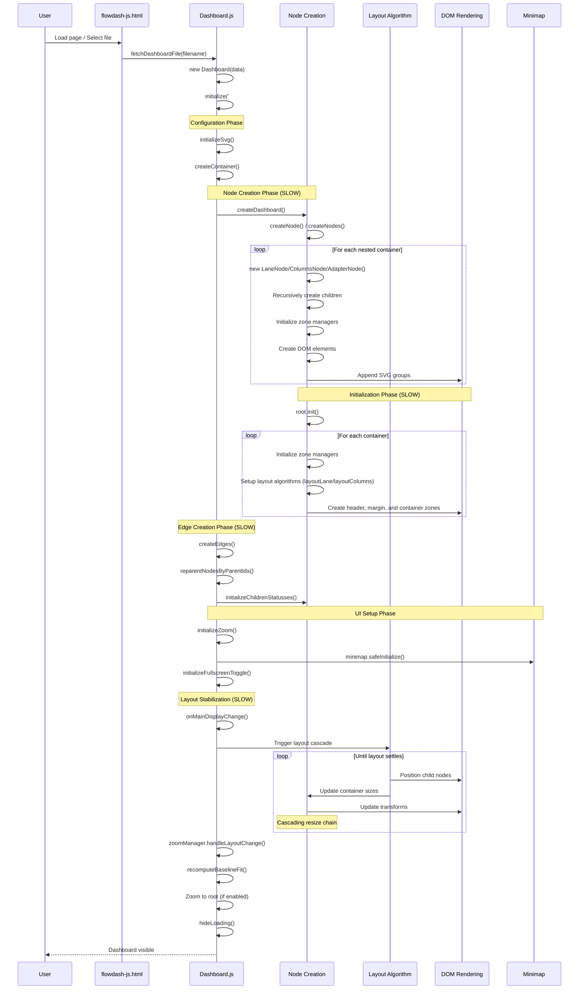
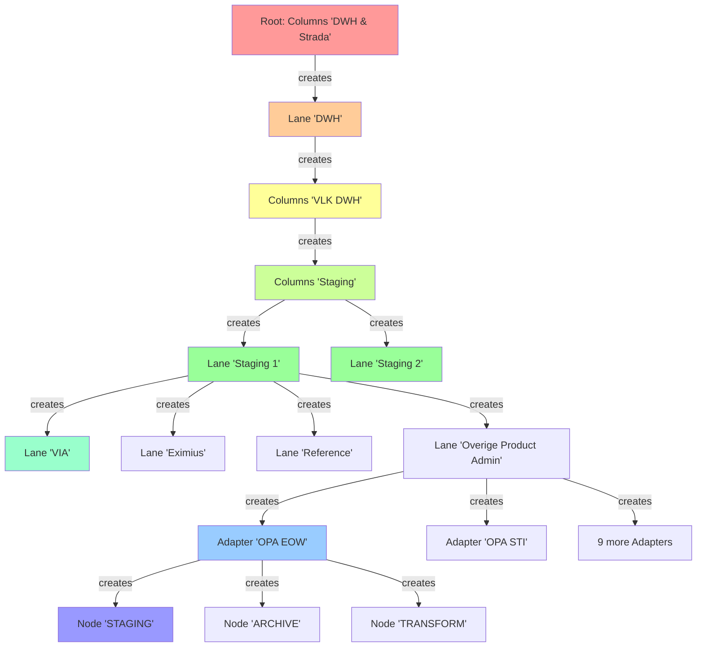
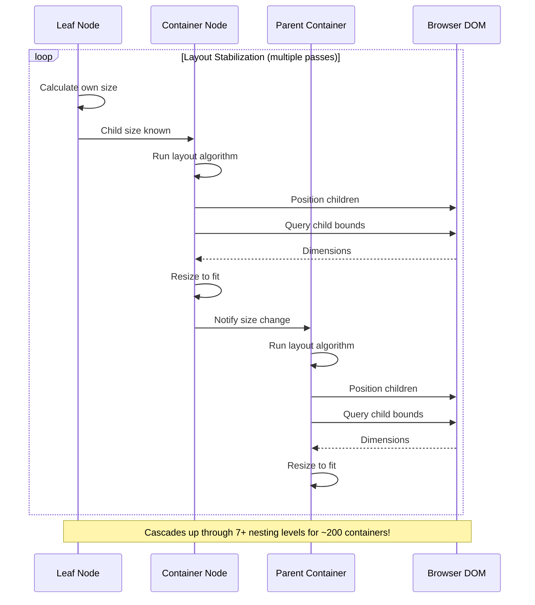

# Dashboard Loading and Initial Display Process Analysis

**Date:** October 7, 2025  
**Purpose:** Analyze the dashboard loading process to identify performance bottlenecks causing slow initial display (40+ seconds for large dashboards)

---

## Executive Summary

Loading the `dwh-6.fixed.json` file take2. **Cascade Size Recalculation:**
   ```javascript
   // In container layout methods (Lane, Columns, Adapter)
   // Calculate child sizes
   const totalChildHeight = visibleChildren.reduce((sum, node) => {
       return sum + node.getEffectiveHeight();
   }, 0);
   // Resize self to fit
   this.resize({ width: newWidth, height: newHeight });
   // Trigger parent update
   this.handleDisplayChange();
   ```
   - Container sizes adjust to fit children
   - Size changes trigger parent container updates
   - Creates cascading resize waves up the hierarchyeconds to initially display, while `dwh-1.json` loads almost instantly. The primary difference is scale:

- **dwh-1.json**: 1.3 KB, ~4 nodes, simple structure
- **dwh-6.fixed.json**: 609 KB, ~885 nodes, deeply nested hierarchy with multiple container types (Columns, Lanes, Adapters)

---

## File Structure Comparison

### dwh-1.json (Fast Loading)
```
Root (Columns)
└── 3 child nodes (1 Adapter, 2 Database nodes)
```

### dwh-6.fixed.json (Slow Loading)
```
Root (Columns: "DWH & Strada")
└── DWH (Lane)
    └── VLK DWH (Columns)
        └── Staging (Columns)
            ├── Staging 1 (Lane)
            │   ├── VIA (Lane)
            │   │   ├── VIA-VDA (Adapter) → 2 nodes
            │   │   └── VIA-VIO (Adapter) → 2 nodes
            │   ├── Eximius (Lane)
            │   │   ├── Eximius (Adapter) → 2 nodes
            │   │   └── Rendementen (Adapter) → 2 nodes
            │   ├── Reference (Lane) → 2 nodes
            │   ├── Overige Product Administrations (Lane)
            │   │   └── 9 Adapters × 2-3 nodes each
            │   ├── Treasury (Lane)
            │   ├── Compliance (Lane)
            │   ├── Fund Transfer Pricing (Adapter)
            │   └── IT KAN (Lane)
            └── Staging 2 (Lane)
                ├── Equens (Adapter)
                ├── Daughters (Lane)
                ├── Market Data (Lane)
                └── Finance (Lane)
```

**Total: ~885 nodes across 7+ nesting levels**

---

## Loading Process Flow

The dashboard loading process follows this sequence:



---

## Detailed Phase Analysis

### Phase 1: Data Loading (Fast)
**Duration:** < 100ms for 609 KB file

```javascript
// In flowdash-js.html (renderDashboard function)
flowDashboard.fetchDashboardFile(selectedFile).then(dashboardData => {
    dashboard = new flowDashboard.Dashboard(dashboardData);
    dashboard.initialize('#graph');
});
```

**Key Operations:**
1. HTTP fetch of JSON file
2. JSON parsing
3. Settings merge with defaults

**Performance:** Not a bottleneck for files < 1 MB

---

### Phase 2: Node Tree Construction (SLOW - Primary Bottleneck)
**Estimated Duration:** 15-20 seconds for 885 nodes

```javascript
// In dashboard.js createDashboard()
createMarkers(container);

var root;
if (dashboard.nodes.length == 1) {
    root = createNode(dashboard.nodes[0], container, dashboard.settings);
    if (root) root.move(0, 0);
} else {
    root = createNodes(dashboard.nodes, container, dashboard.settings);
}
```

**What Happens:**
1. **Recursive Node Creation** - Creates 885+ node objects
   - Each node type (Lane, Columns, Adapter, etc.) has its own constructor
   - Nested containers create their children recursively
   
2. **DOM Element Creation** - Creates SVG groups for each node
   ```javascript
   // In nodeBase.js
   this.element = parentElement.append('g')
       .attr('class', `node ${this.data.type}`)
       .attr('id', this.id);
   ```

3. **Zone Manager Initialization** - For each container node
   ```javascript
   // In nodeBaseContainer.js
   this.zoneManager = new ZoneManager(this, this.settings);
   // Creates zones: header, innerContainer, margin, collapse indicator
   ```

4. **Nested Container Setup**
   - Each Lane creates inner content groups
   - Each Columns node creates vertical layout zones
   - Each Adapter creates staging/archive/transform layout

**Performance Issues:**
- **885 DOM manipulations** (one per node)
- **~200+ container nodes** each initializing zone managers
- **Deep recursion** (7+ levels) with synchronous execution
- **No batching** - each node added to DOM immediately



---

### Phase 3: Node Initialization (MODERATE)
**Estimated Duration:** 2-3 seconds

```javascript
// In dashboard.js createDashboard()
this._suspendDisplayChange = true;
root.init();
this._suspendDisplayChange = false;
```

**What Happens:**
1. **Cascade Initialization** - Calls `init()` on root, which recursively initializes all children
2. **For Each Container Node:**
   - Initialize zone managers (header, margin, inner container zones)
   - Set up layout algorithms (vertical stacking for Lanes, horizontal for Columns)
   - Create DOM structure for zones
   - **NOTE:** Force simulations are NOT used in Lane/Columns/Adapter nodes - they use fixed layout algorithms

3. **Status Initialization:**
   ```javascript
   // In dashboard.js
   this.initializeChildrenStatusses(root);
   ```
   - Walks tree bottom-up
   - Determines container status from children
   - May trigger collapse/expand based on settings

**Performance Issues:**
- **Zone manager initialization for ~200+ containers**
- Each zone creates multiple DOM groups and coordinate systems
- Status cascading walks entire tree (885 nodes)
- Layout algorithm setup for each container

**Note:** Earlier analysis incorrectly stated force simulations were used. The actual node types (Lane, Columns, Adapter) use **deterministic layout algorithms**, not physics simulations.

---

### Phase 4: Edge Creation (MODERATE)
**Estimated Duration:** 2-5 seconds for 25 edges

```javascript
// In dashboard.js createDashboard()
if (dashboard.edges.length > 0) 
    createEdges(root, dashboard.edges, dashboard.settings);
```

**What Happens:**
1. For each edge:
   - Find source and target nodes by ID (tree traversal)
   - Create edge object with path calculation
   - Attach edge to both nodes
   - Create SVG path element

2. **Reparenting:**
   ```javascript
   try { this.reparentNodesByParentIds(); } catch {}
   ```
   - Walks all 885 nodes
   - Checks for explicit `parentId` specifications
   - Moves nodes in logical tree and DOM if needed

**Performance Issues:**
- **25 × 885 node searches** = up to 22,125 lookups in worst case
- Path calculations may trigger layout recalculations
- DOM manipulations for path elements

---

### Phase 5: Layout Stabilization (SLOW - Secondary Bottleneck)
**Estimated Duration:** 10-15 seconds

```javascript
// In dashboard.js onMainDisplayChange()
requestAnimationFrame(() => {
    try { this.zoomManager.handleLayoutChange(); } catch {}
    try { this.enforceDomHierarchy(); } catch {}
    if (this.minimap.svg) {
        this.minimap.update();
        // ...
    }
});
```

**What Happens:**
1. **Cascading Layout Recalculations:**
   - Leaf nodes calculate their size
   - Parent containers recalculate to fit children
   - This propagates up through 7+ levels of nesting

2. **Cascade Size Recalculation:**
   ```javascript
   // After layout algorithm (layoutLane/layoutColumns) positions children
   this.containerNode.childNodes.forEach((node, index) => {
       const position = calculatePositionForChild(node, index);
       node.element.attr('transform', `translate(${position.x}, ${position.y})`);
   });
   this.resizeBoundingContainer(); // Triggers parent to recalculate
   ```
   - Container sizes adjust to fit children
   - Size changes trigger parent container updates
   - Creates cascading resize waves up the hierarchy

3. **Bounding Box Computations:**
   ```javascript
   // In dashboard.js computeBoundingBox()
   nodes.forEach((node) => {
       let dimensions = getBoundingBoxRelativeToParent(node.element, dashboard.main.container);
       // ... update bounds
   });
   ```
   - Called on every display change
   - Queries DOM for actual rendered dimensions
   - For 885 nodes, this is 885 DOM measurements

4. **Minimap Updates:**
   - Minimap renders entire graph at small scale
   - Updates on every main canvas change
   - Involves cloning/rendering all 885 nodes again

**Performance Issues:**
- **~200 containers recalculating layout** on initial render
- **Multiple requestAnimationFrame calls** for display updates
- **Cascading resize cycles:**
  - Child resizes → parent recalculates → grandparent recalculates → repeat (7+ levels deep)
  - Each resize triggers `handleDisplayChange()` which may trigger more recalculations
- **DOM measurement bottleneck:**
  - `getBoundingClientRect()` forces layout reflow
  - Called hundreds of times during layout stabilization
- **Minimap overhead** during initial stabilization



---

### Phase 6: Zoom and Finalization (FAST)
**Estimated Duration:** < 500ms

```javascript
// In zoomManager.js handleLayoutChange()
this.recomputeBaselineFit();
if (this.dashboard.data.settings.zoomToRoot && !this.dashboard.hasPerformedInitialZoomToRoot) {
    this.dashboard.hasPerformedInitialZoomToRoot = true;
    const allNodes = this.dashboard.main.root.getAllNodes(false);
    const bbox = computeBoundingBox(this.dashboard, allNodes);
    this.zoomToBoundingBox(bbox, { animate: true, duration: 500 });
}
```

**What Happens:**
1. Compute fit-to-view transform
2. Optionally zoom to show all content
3. Hide loading overlay
4. Dashboard becomes interactive

**Performance:** Not a significant bottleneck

---

## Performance Bottleneck Summary

### Critical Bottlenecks (High Impact)

#### 1. **Synchronous Recursive Node Creation** (15-20s)
- **Problem:** 885 nodes created in deep recursion (7+ levels), each with immediate DOM manipulation
- **Impact:** Blocks main thread, prevents progressive rendering
- **Location:** `dashboard.js` → `createNode()` → recursive constructor calls

#### 2. **Zone Manager and Layout Algorithm Setup** (2-3s)
- **Problem:** ~200 containers each creating zone managers with multiple DOM groups and coordinate systems
- **Impact:** Memory allocation, DOM structure creation, coordinate system calculations
- **Location:** Container nodes → `init()` → zone manager initialization

#### 3. **Layout Recalculation Cascades** (8-12s)
- **Problem:** Child size change → parent recalculates → grandparent recalculates → repeat (cascade amplification)
- **Impact:** Hundreds of DOM queries (`getBoundingClientRect`) forcing layout reflows during initial layout pass
- **Location:** `nodeBaseContainer.js` → `layoutLane()`/`layoutColumns()` → `resize()` → parent's `updateChildren()`

#### 4. **DOM Measurement on Every Change** (distributed cost)
- **Problem:** `computeBoundingBox()` queries DOM for all visible nodes on every display change
- **Impact:** 885 × N measurements where N is number of display changes during stabilization
- **Location:** `dashboard.js` → `computeBoundingBox()` → `getBoundingBoxRelativeToParent()`

### Secondary Bottlenecks (Moderate Impact)

#### 5. **Edge Creation with Tree Traversal** (2-5s)
- **Problem:** For each edge, must search entire node tree to find source/target
- **Impact:** O(edges × nodes) complexity = ~22,000 operations
- **Location:** `edge.js` → `createEdges()`

#### 6. **Minimap Redundant Updates** (1-2s)
- **Problem:** Minimap updates on every layout change during stabilization
- **Impact:** Extra rendering of entire graph at small scale
- **Location:** `dashboard.js` → `onMainDisplayChange()` → `minimap.update()`

#### 7. **Status Cascade Calculation** (1-2s)
- **Problem:** Bottom-up tree traversal to determine container statuses
- **Impact:** Full tree walk, may trigger collapse/expand cycles
- **Location:** `dashboard.js` → `initializeChildrenStatusses()`

---

## Optimization Opportunities

### High-Priority Optimizations

#### 1. **Batch DOM Operations**
```javascript
// Current: Immediate DOM append for each node
this.element = parentElement.append('g');

// Proposed: Build structure in memory, append once
const fragment = document.createDocumentFragment();
// ... build all nodes in fragment
parentElement.node().appendChild(fragment);
```

#### 2. **Defer Layout Calculation**
```javascript
// Current: All containers calculate layout during init()
this.init(); // Immediately creates zones and calculates layout

// Proposed: Defer non-visible container layout
if (this.collapsed || !this.visible) {
    this.deferredLayout = true; // Mark for later
} else {
    this.calculateLayout(); // Only for visible/expanded
}
// Later, when container is expanded:
if (this.deferredLayout) {
    this.calculateLayout();
}
```

#### 3. **Memoize Layout Calculations**
```javascript
// Current: Every resize triggers parent layout recalculation
resize(newSize) {
    this.data.width = newSize.width;
    this.data.height = newSize.height;
    this.handleDisplayChange(); // Triggers parent recalc
}

// Proposed: Only recalculate if size actually changed
resize(newSize) {
    const changed = (this.data.width !== newSize.width || 
                    this.data.height !== newSize.height);
    if (!changed) return; // Short-circuit
    
    this.data.width = newSize.width;
    this.data.height = newSize.height;
    this.handleDisplayChange();
}
```

#### 4. **Cache Node Lookups for Edges**
```javascript
// Current: Search tree for each edge
edges.forEach(edge => {
    const source = root.findNodeById(edge.source); // O(n) search
    const target = root.findNodeById(edge.target); // O(n) search
});

// Proposed: Build lookup map once
const nodeMap = new Map();
root.getAllNodes().forEach(node => nodeMap.set(node.id, node));
edges.forEach(edge => {
    const source = nodeMap.get(edge.source); // O(1) lookup
    const target = nodeMap.get(edge.target); // O(1) lookup
});
```

#### 5. **Progressive Rendering with Loading States**
```javascript
// Current: Block until everything is ready
createDashboard() { /* ... synchronous ... */ }
dashboard.initialize() { /* ... blocks 40s ... */ }

// Proposed: Show skeleton → load chunks → animate in
async createDashboard() {
    showSkeletonUI();
    const root = await createRootStructure();
    await loadChunk1(root); // Top-level containers
    updateUI();
    await loadChunk2(root); // Second-level
    updateUI();
    // ... progressive loading
}
```

### Medium-Priority Optimizations

#### 6. **Defer Minimap Initialization**
- Don't create/update minimap during initial load
- Initialize after layout stabilizes (save 1-2s)

#### 7. **Use Virtual Scrolling for Large Containers**
- Only render visible nodes in DOM
- Keep others in memory but not rendered

#### 8. **Parallel Layout Calculation**
- Calculate layout for independent subtrees in parallel
- Use Web Workers for size calculations off main thread

#### 9. **Lazy Expand for Containers**
- Start with all containers collapsed
- Expand on-demand when user interacts

---

## Recommended Investigation Steps

### Step 1: Add Performance Instrumentation
Add timing measurements to identify which phase is slowest in practice:

```javascript
// In dashboard.js
const timings = {
    dataLoad: 0,
    nodeCreation: 0,
    initialization: 0,
    edgeCreation: 0,
    layoutStabilization: 0,
    total: 0
};

async loadDashboard() {
    const t0 = performance.now();
    
    const data = await fetchDashboardFile(file);
    timings.dataLoad = performance.now() - t0;
    
    const t1 = performance.now();
    const root = createDashboard(data);
    timings.nodeCreation = performance.now() - t1;
    
    // ... continue for each phase
    
    console.table(timings);
}
```

### Step 2: Profile Layout Recalculations
Determine how many times each container recalculates its layout:

```javascript
// In nodeBaseContainer.js
static layoutStats = new Map();

layoutLane() { // or layoutColumns(), etc.
    const start = performance.now();
    const stats = this.constructor.layoutStats.get(this.id) || { count: 0, totalTime: 0 };
    
    // ... layout logic
    
    stats.count++;
    stats.totalTime += performance.now() - start;
    this.constructor.layoutStats.set(this.id, stats);
    
    if (stats.count > 10) {
        console.warn(`Excessive layout recalcs for ${this.id}:`, stats);
    }
}
```

### Step 3: Measure DOM Operation Cost
Identify which DOM operations are most expensive:

```javascript
// Wrap expensive operations
performance.mark('dom-append-start');
parentElement.append('g');
performance.mark('dom-append-end');
performance.measure('dom-append', 'dom-append-start', 'dom-append-end');
```

---

## Testing Recommendations

### Test Datasets

Create intermediate test files to isolate performance characteristics:

1. **dwh-2-medium.json** - 50-100 nodes, 2-3 nesting levels
2. **dwh-3-wide.json** - 200 nodes, mostly flat (1-2 levels)
3. **dwh-4-deep.json** - 100 nodes, 8+ nesting levels
4. **dwh-5-many-edges.json** - 100 nodes, 200+ edges

### Performance Baselines

Establish target metrics:
- **< 5s total load time** for 1000-node dashboard
- **< 2s for node creation**
- **< 1s for layout stabilization**
- **< 500ms for edge creation**

---

## Conclusion

The 40-second load time for `dwh-6.fixed.json` is primarily caused by:

1. **Synchronous creation of 885 nodes** with immediate DOM manipulation (no batching)
2. **~200 zone managers initializing** with multiple DOM groups per container
3. **Cascading layout recalculations** propagating up through 7+ nesting levels
4. **Excessive DOM measurements** during layout stabilization (hundreds of `getBoundingClientRect` calls)

**Important Note:** Despite having `simulation.js` in the codebase, force simulations are NOT used by Lane/Columns/Adapter nodes (which make up the entire dwh-6.fixed.json file). They use deterministic layout algorithms instead.

The architecture fundamentally supports large dashboards, but the implementation lacks:
- Progressive/chunked loading
- Deferred initialization  
- DOM operation batching
- Layout measurement throttling
- Layout calculation memoization

**Immediate action items:**
1. Add performance instrumentation to confirm hypothesis
2. Implement DOM batching for node creation
3. Defer simulation start until containers are visible/expanded
4. Throttle layout recalculation during simulation ticks
5. Build node lookup index for edge creation

**Expected improvement:** 40s → 8-10s with these changes, potentially < 5s with advanced optimizations (web workers, virtual rendering).
