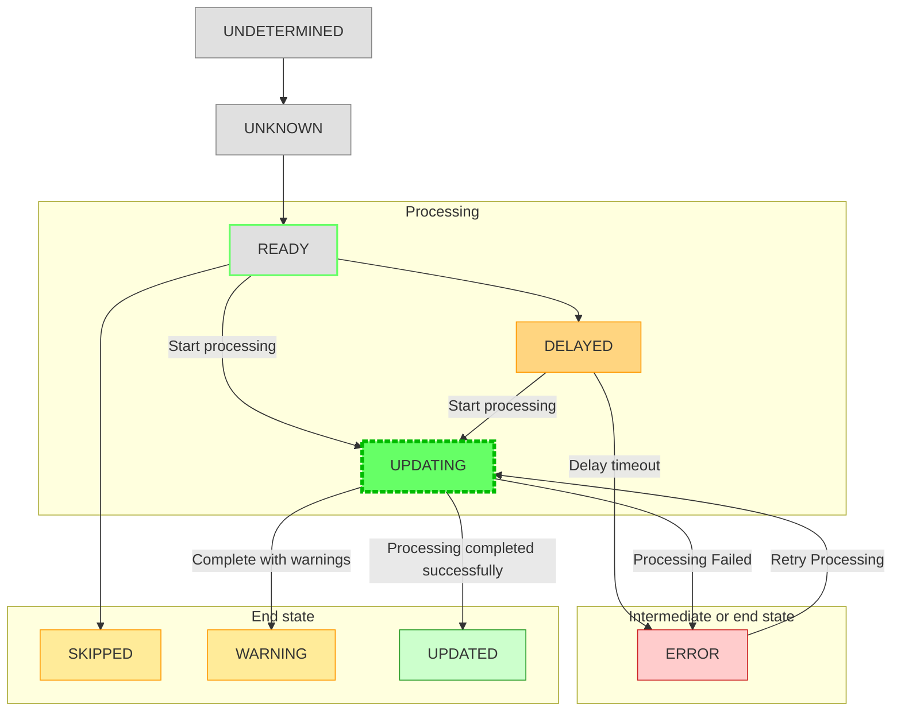

# State

## Node States

Node states are defined in the `NodeStatus` object and represent the current status of a node in the flow diagram.

### State Definitions

| State | Category | Description |
|-------|:----------:|-------------|
| `UNDETERMINED` | Initial | Node state has not been determined yet, there never has been any information about the dataset |
| `UNKNOWN` | Initial | Node state is unknown or not set |
| `READY` | Process | Node is ready to be processed |
| `UPDATING` | Process | Node is currently being updated/processed |
| `DELAYED` | Process | Node processing is delayed |
| `ERROR` | Process / End state | Node has encountered an error |
| `UPDATED` | End state | Node has been successfully updated |
| `SKIPPED` | End state | Node was skipped during processing |
| `WARNING` | End state | Node has a warning state |
| `DISABLED` | Inactive | Node is disabled and will not process |

### State Transitions

### State Behavior

#### Status Cascading
When `cascadeOnStatusChange` is enabled in settings:
- Status changes propagate up to parent containers
- Container nodes recalculate their status based on child node states

## Edge States

_Documentation for edge states to be added._
