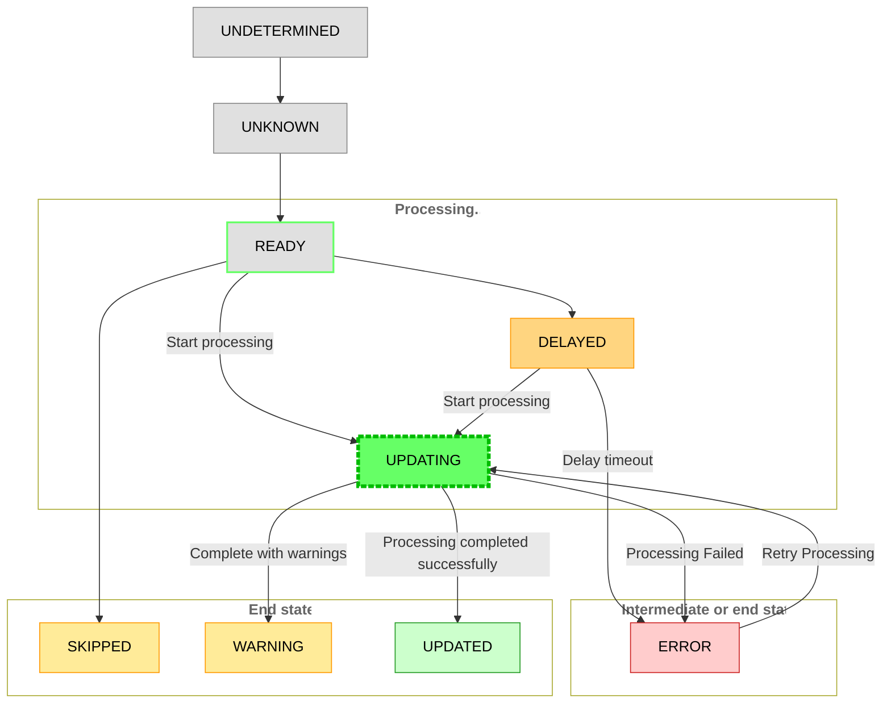
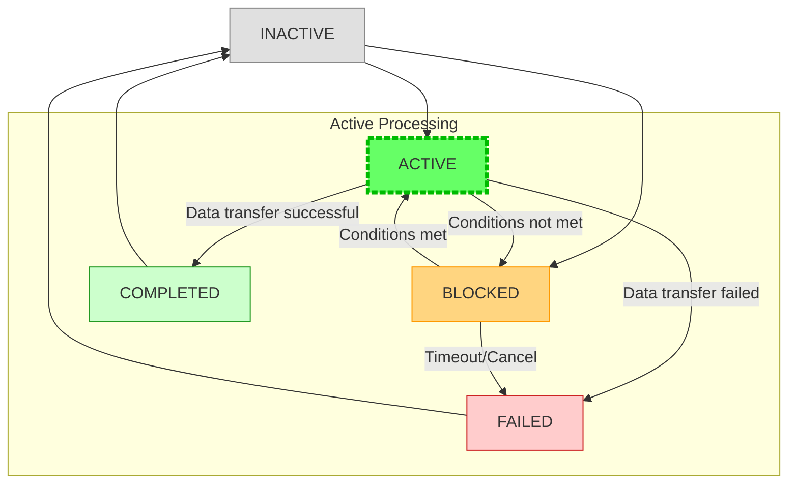

# State

## Node States

Node states are defined in the `NodeStatus` object and represent the current status of a node in the flow diagram.

### State Definitions

| State | Category | Description |
|-------|:----------:|-------------|
| `UNDETERMINED` | Initial | Node state has not been determined yet, there never has been any information about the dataset |
| `UNKNOWN` | Initial | Node state is unknown or not set |
| `READY` | Process | Node is ready to be processed |
| `UPDATING` | Process | Node is currently being updated/processed |
| `DELAYED` | Process | Node processing is delayed |
| `ERROR` | Process / End state | Node has encountered an error |
| `UPDATED` | End state | Node has been successfully updated |
| `SKIPPED` | End state | Node was skipped during processing |
| `WARNING` | End state | Node has a warning state |
| `DISABLED` | Inactive | Node is disabled and will not process |

### State Transitions

### State Behavior

#### Status Cascading
When `cascadeOnStatusChange` is enabled in settings:
- Status changes propagate up to parent containers
- Container nodes recalculate their status based on child node states

## Edge States

Edge states represent the current status of connections between nodes in the flow diagram.

### State Definitions

| State | Category | Description |
|-------|:----------:|-------------|
| `INACTIVE` | Initial | Edge is not active, connection exists but no data flow |
| `ACTIVE` | Process | Edge is actively transferring data between nodes |
| `COMPLETED` | End state | Data transfer completed successfully |
| `FAILED` | End state | Data transfer failed or connection error |
| `BLOCKED` | Process | Edge is blocked, waiting for conditions to be met |

### State Transitions

### State Behavior

#### Edge Status Based on Connected Nodes
Edge states are typically derived from the states of their connected nodes:
- If source node is `UPDATING` and target node is `READY`, edge becomes `ACTIVE`
- If source node is `UPDATED` and data successfully transferred, edge becomes `COMPLETED`
- If either source or target node has `ERROR` state, edge may become `FAILED`
- If source node is `DELAYED`, edge may become `BLOCKED`

#### Visual Representation
Edge states affect their visual appearance:
- `INACTIVE`: Dashed or gray line
- `ACTIVE`: Solid, animated line with flow indicators
- `COMPLETED`: Solid line with completion marker
- `FAILED`: Red or error-colored line
- `BLOCKED`: Orange or warning-colored line

#### Edge State Propagation
Edge states can influence connected nodes:
- Multiple `FAILED` edges may trigger source node to enter `ERROR` state
- `BLOCKED` edges may cause target node to remain in `READY` state
- `ACTIVE` edges indicate data flow in progress between `UPDATING` nodes
